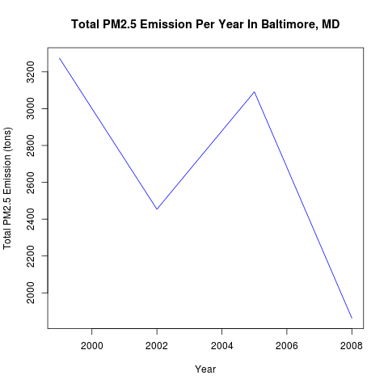
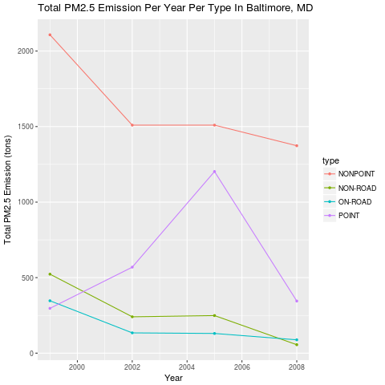
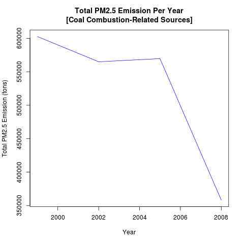
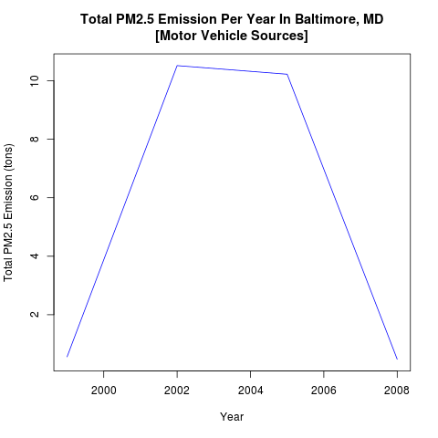
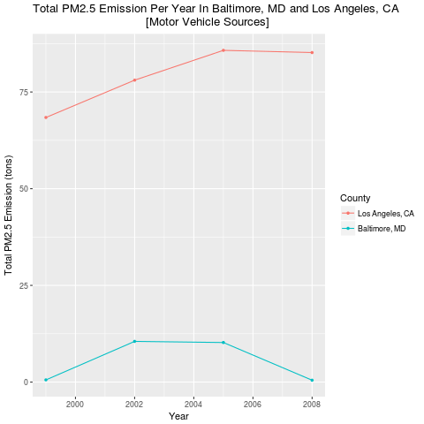

This is a course project for forth week of course https://www.coursera.org/learn/exploratory-data-analysis/

## Instructions

Fine particulate matter (PM2.5) is an ambient air pollutant for which there is strong evidence that it is harmful to human health. In the United States, the Environmental Protection Agency (EPA) is tasked with setting national ambient air quality standards for fine PM and for tracking the emissions of this pollutant into the atmosphere. Approximatly every 3 years, the EPA releases its database on emissions of PM2.5. This database is known as the National Emissions Inventory (NEI). You can read more information about the NEI at the <a href="https://www.epa.gov/air-emissions-inventories">EPA National Emissions Inventory</a> web site.

For each year and for each type of PM source, the NEI records how many tons of PM2.5 were emitted from that source over the course of the entire year. The data that you will use for this assignment are for 1999, 2002, 2005, and 2008.

### Review criteria

For each question
<ol>
<li>Does the plot appear to address the question being asked?</li>
<li>Is the submitted R code appropriate for construction of the submitted plot?</li>
</ol>

### Data

The data for this assignment are available from the course web site as a single zip file: <a href="https://d396qusza40orc.cloudfront.net/exdata%2Fdata%2FNEI_data.zip">Data for Peer Assessment [29Mb]</a> which is also currently is in repository. The zip file contains two files:

<b>PM2.5 Emissions Data</b> (`𝚜𝚞𝚖𝚖𝚊𝚛𝚢𝚂𝙲𝙲_𝙿𝙼𝟸𝟻.𝚛𝚍𝚜`): This file contains a data frame with all of the PM2.5 emissions data for 1999, 2002, 2005, and 2008. For each year, the table contains number of tons of PM2.5 emitted from a specific type of source for the entire year. Here are the first few rows:

```
##     fips      SCC Pollutant Emissions  type year
## 4  09001 10100401  PM25-PRI    15.714 POINT 1999
## 8  09001 10100404  PM25-PRI   234.178 POINT 1999
## 12 09001 10100501  PM25-PRI     0.128 POINT 1999
## 16 09001 10200401  PM25-PRI     2.036 POINT 1999
## 20 09001 10200504  PM25-PRI     0.388 POINT 1999
## 24 09001 10200602  PM25-PRI     1.490 POINT 1999
```

<ol>
<li>𝚏𝚒𝚙𝚜: A five-digit number (represented as a string) indicating the U.S. county</li>
<li>𝚂𝙲𝙲: The name of the source as indicated by a digit string (see source code classification table)</li>
<li>𝙿𝚘𝚕𝚕𝚞𝚝𝚊𝚗𝚝: A string indicating the pollutant</li>
<li>𝙴𝚖𝚒𝚜𝚜𝚒𝚘𝚗𝚜: Amount of PM2.5 emitted, in tons</li>
<li>𝚝𝚢𝚙𝚎: The type of source (point, non-point, on-road, or non-road)</li>
<li>𝚢𝚎𝚊𝚛: The year of emissions recorded</li>
</ol>

<b>Source Classification Code Table</b> (`𝚂𝚘𝚞𝚛𝚌𝚎_𝙲𝚕𝚊𝚜𝚜𝚒𝚏𝚒𝚌𝚊𝚝𝚒𝚘𝚗_𝙲𝚘𝚍𝚎.𝚛𝚍𝚜`): This table provides a mapping from the SCC digit strings in the Emissions table to the actual name of the PM2.5 source. The sources are categorized in a few different ways from more general to more specific and you may choose to explore whatever categories you think are most useful. For example, source “10100101” is known as “Ext Comb /Electric Gen /Anthracite Coal /Pulverized Coal”.

You can read each of the two files using the 𝚛𝚎𝚊𝚍𝚁𝙳𝚂() function in R. For example, reading in each file can be done with the foll
``` python
## This first line will likely take a few seconds. Be patient!
NEI <- readRDS("summarySCC_PM25.rds")
SCC <- readRDS("Source_Classification_Code.rds")
```
as long as each of those files is in your current working directory (check by calling ```𝚍𝚒𝚛()``` and see if those files are in the listing).

### Assignment
The overall goal of this assignment is to explore the National Emissions Inventory database and see what it say about fine particulate matter pollution in the United states over the 10-year period 1999–2008. You may use any R package you want to support your analysis.

### Questions
You must address the following questions and tasks in your exploratory analysis. For each question/task you will need to make a single plot. Unless specified, you can use any plotting system in R to make your plot.

<ol>
<li>Have total emissions from PM2.5 decreased in the United States from 1999 to 2008? Using the base plotting system, make a plot showing the total PM2.5 emission from all sources for each of the years 1999, 2002, 2005, and 2008.
<li>Have total emissions from PM2.5 decreased in the Baltimore City, Maryland (𝚏𝚒𝚙𝚜 == "𝟸𝟺𝟻𝟷𝟶") from 1999 to 2008? Use the base plotting system to make a plot answering this question.</li>
<li>Of the four types of sources indicated by the 𝚝𝚢𝚙𝚎 (point, nonpoint, onroad, nonroad) variable, which of these four sources have seen decreases in emissions from 1999–2008 for Baltimore City? Which have seen increases in emissions from 1999–2008? Use the ggplot2 plotting system to make a plot answer this question.</li>
<li>Across the United States, how have emissions from coal combustion-related sources changed from 1999–2008?</li>
<li>How have emissions from motor vehicle sources changed from 1999–2008 in Baltimore City?</li>
<li>Compare emissions from motor vehicle sources in Baltimore City with emissions from motor vehicle sources in Los Angeles County, California (𝚏𝚒𝚙𝚜 == "𝟶𝟼𝟶𝟹𝟽"). Which city has seen greater changes over time in motor vehicle emissions?</li>
</ol>

### Making and Submitting Plots
For each plot you should

 * Construct the plot and save it to a PNG file.
 * Create a separate R code file (𝚙𝚕𝚘𝚝𝟷.𝚁, 𝚙𝚕𝚘𝚝𝟸.𝚁, etc.) that constructs the corresponding plot, i.e. code in plot1.R constructs the plot1.png plot. Your code file should include code for reading the data so that the plot can be fully reproduced. You must also include the code that creates the PNG file. Only include the code for a single plot (i.e. 𝚙𝚕𝚘𝚝𝟷.𝚁 should only include code for producing 𝚙𝚕𝚘𝚝𝟷.𝚙𝚗𝚐)
 * Upload the PNG file on the Assignment submission page
 * Copy and paste the R code from the corresponding R file into the text box at the appropriate point in the peer assessment.

### Results

Perhaps it is better to use somewhere boxplots or histograms, but it is also possible to answer questions using usual plots.

#### The answer to question 1
```
> source("plot1.R");
```


#### The answer to question 2
```
> source("plot2.R");
```


#### The answer to question 3
```
> source("plot3.R");
```


#### The answer to question 4
```
> source("plot4.R");
```


#### The answer to question 5
```
> source("plot5.R");
```


#### The answer to question 6
```
> source("plot6.R");
```

